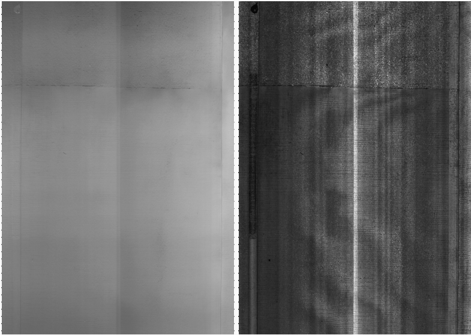
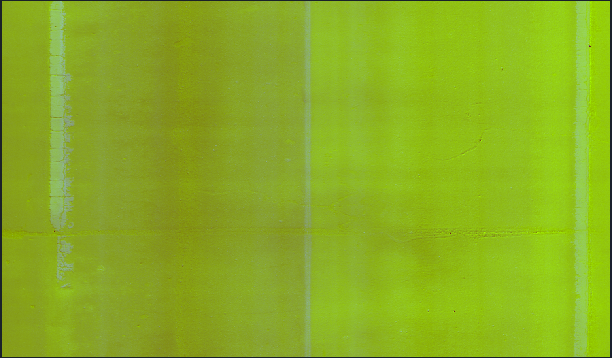
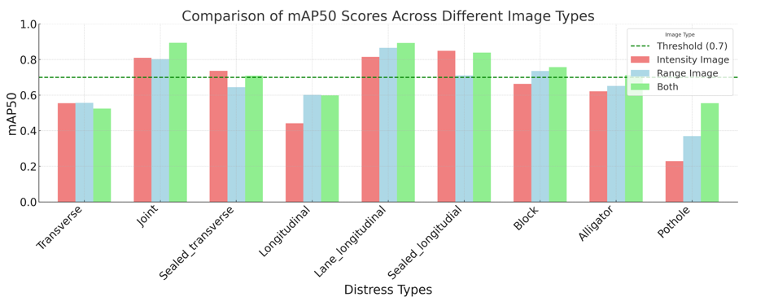
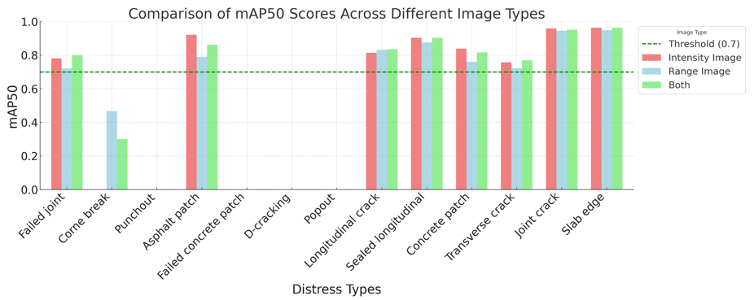

# TxDoc Project Brief (Stepwise)

> Audience: Advisors (Dr. Wang / Dr. Tesic / Dr. Bai) Presenter: Wenhan Tao Purpose: Consolidate two source lines (Dr. Gong & Dr. Biswas), current progress, evidence, issues, and asks.

## 0. Experiment Basics & Data Overview

- **Datasets**: three sets — **ACP** (asphalt), **JCP** (concrete), **CRCP** (concrete). Practically this forms **two material families** (asphalt vs. concrete), which require **different preprocessing/learning strategies**.
- **Modalities**: each dataset sample contains **2D Intensity** (surface appearance) and **3D Range** (depth/height). We **fuse** them into a 3‑channel image:
  - **Channel‑1** ← Intensity
  - **Channel‑2** ← Range
  - **Channel‑3** ← constant **128** (stabilizes dynamic range & color mapping)
- **Why the green look in the composite**: with Intensity and Range mapped to the first two channels and a fixed **128** in the third channel, the RGB visualization biases toward **greenish** tones.

**Figure 1. Raw modalities** — *left: Range (3D depth); right: Intensity (2D surface).*\


**Figure 2. Composite example (Intensity + Range + const‑128)** — *the green appearance comes from the constant third channel.*\


---

## 1. One‑Page Overview (baseline tone)

- **Setup**: Start from \*\*Dr. Biswas’s best YOLOv8 (Intensity‑only) \*\***`best.pt`** on **JCP**. Re‑trained with the **same training configuration** (`args.yaml`), using **Ultralytics’ built‑in loss** (*no MoPac+*).
- **Training data**: **Dr. Gong’s fused dataset** (Intensity + Range). **Epochs = 50**. All other knobs kept aligned with Biswas’s config.
- **JCP results**: mAP\@0.5 improved from **0.691 (Biswas)** and **0.670 (Gong)** to **0.763 (ours)** under the same evaluation protocol.
- **CRCP results**: (Biswas N/A). Baseline **Gong = 0.739** → **Ours = 0.773**. CRCP is similar to JCP and **Intensity dominates Range** in quality.
- **ACP results**: (Biswas N/A). **Gong = 0.812** → **Ours = 0.721**. ACP differs substantially from JCP/CRCP and is **Range‑dominant**.
- **Main question for this meeting**: **How to raise accuracy on ACP.**

---


## 2. Work from Dr. Gong (baseline tone & concrete diffs)

### 2.1 Context & Inputs

- **Source**: Custom YOLOv5 fork with split-style blocks.

### 2.2 Architectural diffs (vs. vanilla YOLOv5)

> *Key idea*: replace standard v5 primitives with **Split** variants to increase per-group feature isolation while keeping the same spatial strides and tensor shapes.

1. **Stem / early backbone (F3 path)**

   - **Original v5**: `Conv(c1→c2, k=3, s=2, g=1)` followed by `C3` blocks.
   - **Dr. Gong variant**: `ConvSplit` (grouped in-channel split, then pointwise fuse) + `C3Split` (Split-enabled C3/CSP). Stride and output shapes unchanged.
   - **Effect**: better separation of texture-like vs. edge-like responses on shallow layers; slight params/FLOPs increase kept minimal.

2. **Bottleneck blocks**

   - **Original v5**: `Bottleneck`/`C3` with standard 1×1→3×3→1×1.
   - **Dr. Gong variant**: `BottleneckSplit` (3×3 branch uses grouped conv; optional channel shuffle inside block to recover cross-group mixing).

3. **SPPF stage**

   - **Original v5**: `SPPF` (1×1 reduce → pooled concat → 1×1 fuse).
   - **Dr. Gong variant**: `SPPFSplit` (apply split/grouped ops in reduce/fuse to keep group consistency; preserves tensor size and stride).

4. **Task registry (monkey-patch) to plug custom ops**

```python
import my_layers
import ultralytics.nn.tasks as tasks

# Map v5 symbolic names to custom implementations
tasks.ConvSplit        = my_layers.ConvSplit
tasks.C3Split          = my_layers.C3Split
tasks.SPPFSplit        = my_layers.SPPFSplit
tasks.BottleneckSplit  = my_layers.BottleneckSplit
```

- **YAML side (example diff)**

```diff
-  - [ -1, 1, Conv,   [64, 3, 2] ]
-  - [ -1, 3, C3,     [64, True] ]
+  - [ -1, 1, ConvSplit,   [64, 3, 2,  g=2] ]
+  - [ -1, 3, C3Split,     [64, True, g=2] ]
...
-  - [ -1, 1, SPPF,   [512, 5] ]
+  - [ -1, 1, SPPFSplit,   [512, 5, g=2] ]
```

5. **Input channels**

- **Original v5**: `ch=3` (RGB).
- **Dr. Gong variant**: typically **two-channel** input *(Intensity + Range)*; set in model/data YAML or first-stem conv. Ensure `ch: 2` (or first conv `in_channels=2`).

6. **Heads / losses**

- **Detection head**: keep v5 anchor-based head for compatibility; no change in output shapes.
- **Training knobs**: same NMS/IoU pipeline; experiments favored slightly higher NMS IoU (e.g., 0.60–0.65) during eval to curb duplicate edge hits.

### 2.3 Completed & Evidence

- ✅ Reproduced training with Split modules; weights & logs archived (paths to be filled).
- ✅ Metric snapshot: mAP\@0.5 = (fill), PR curves, per-class AP (fill).

#### 2.3.a Validation Results (Intensity + Range; **val** split)

**Table 1 — ACP (val)**

| Class               | Images | Instances | P     | R     | mAP50 | mAP50-95 |
| ------------------- | ------ | --------- | ----- | ----- | ----- | -------- |
| All                 | 1039   | 2043      | 0.783 | 0.781 | 0.812 | 0.414    |
| Transverse          | 1039   | 222       | 0.828 | 0.694 | 0.824 | 0.329    |
| Joint               | 1039   | 84        | 0.885 | 0.827 | 0.933 | 0.369    |
| Sealed transverse   | 1039   | 327       | 0.897 | 0.749 | 0.892 | 0.415    |
| Longitudinal        | 1039   | 306       | 0.753 | 0.686 | 0.788 | 0.399    |
| Lane longitudinal   | 1039   | 251       | 0.834 | 0.773 | 0.850 | 0.459    |
| Sealed longitudinal | 1039   | 629       | 0.886 | 0.836 | 0.899 | 0.461    |
| Block               | 1039   | 50        | 0.830 | 0.720 | 0.882 | 0.629    |
| Alligator           | 1039   | 143       | 0.834 | 0.703 | 0.820 | 0.484    |
| Pothole             | 1039   | 31        | 0.799 | 0.323 | 0.480 | 0.184    |

**Table 2 — JCP (val)**

| Class                   | Images | Instances | P     | R     | mAP50 | mAP50-95 |
| ----------------------- | ------ | --------- | ----- | ----- | ----- | -------- |
| All                     | 1550   | 3392      | 0.762 | 0.624 | 0.670 | 0.367    |
| Failed joint            | 1550   | 106       | 0.751 | 0.708 | 0.780 | 0.409    |
| Corner break            | 1550   | 72        | 0.635 | 0.514 | 0.577 | 0.198    |
| Punchout                | 1550   | 23        | 0.497 | 0.387 | 0.399 | 0.169    |
| Asphalt patch           | 1550   | 84        | 0.745 | 0.583 | 0.698 | 0.428    |
| Failed concrete patch   | 1550   | 8         | 0.388 | 0.250 | 0.227 | 0.131    |
| Popout                  | 1550   | 10        | 1.000 | 0.000 | 0.027 | 0.000942 |
| Longitudinal crack      | 1550   | 192       | 0.759 | 0.724 | 0.821 | 0.378    |
| Sealed longitudinal     | 1550   | 90        | 0.840 | 0.833 | 0.827 | 0.446    |
| Concrete patch          | 1550   | 154       | 0.756 | 0.805 | 0.821 | 0.516    |
| Transverse crack        | 1550   | 103       | 0.822 | 0.647 | 0.720 | 0.352    |
| Joint crack             | 1550   | 831       | 0.920 | 0.954 | 0.961 | 0.592    |
| Sealed transverse crack | 1550   | 12        | 0.861 | 0.750 | 0.881 | 0.446    |
| Slab edge               | 1550   | 1707      | 0.930 | 0.933 | 0.975 | 0.709    |

**Table 3 — CRCP (val)**

| Class                     | Images | Instances | P     | R     | mAP50 | mAP50-95 |
| ------------------------- | ------ | --------- | ----- | ----- | ----- | -------- |
| All                       | 1156   | 2753      | 0.712 | 0.696 | 0.739 | 0.384    |
| Longitudinal crack        | 1156   | 73        | 0.520 | 0.205 | 0.190 | 0.0444   |
| Sealed longitudinal crack | 1156   | 21        | 0.686 | 0.714 | 0.754 | 0.376    |
| Punchout                  | 1156   | 18        | 0.730 | 0.754 | 0.829 | 0.338    |
| Asphalt patch             | 1156   | 226       | 0.898 | 0.934 | 0.965 | 0.619    |
| Concrete patch            | 1156   | 31        | 0.629 | 0.581 | 0.714 | 0.415    |
| Transverse crack          | 1156   | 2259      | 0.736 | 0.826 | 0.835 | 0.485    |
| Sealed transverse crack   | 1156   | 77        | 0.801 | 0.870 | 0.877 | 0.497    |
| Spalled transverse crack  | 1156   | 48        | 0.696 | 0.688 | 0.751 | 0.328    |

> *Note*: all three are **Intensity + Range fusion** runs from Dr. Gong’s pipeline. We can add PR curves/Confusion matrices as figures if needed.

### 2.4 Issues / Help needed (priority)

1. **Channel alignment when migrating to v8**
   - **Symptom**: loading v5 Split weights into v8 graph fails when `ch=2` vs. v8 default `ch=3`.
   - **What we tried**: set `ch:2` in v8 YAML; verify first stem `in_channels`; still mismatch on custom layers.
   - **Working hypothesis**: custom Split blocks require one-to-one layer name & param shape mapping; v8’s `C2f` differs from v5 `C3`.
   - **Ask**: sign-off on (A) keep v5 pipeline for 2‑ch data; (B) write a small **state\_dict remapper** to adapt keys/shapes when moving to v8.
     / Help needed (priority)
2. **Channel alignment when migrating to v8**
   - **Symptom**: loading v5 Split weights into v8 graph fails when `ch=2` vs. v8 default `ch=3`.
   - **What we tried**: set `ch:2` in v8 YAML; verify first stem `in_channels`; still mismatch on custom layers.
   - **Working hypothesis**: custom Split blocks require one-to-one layer name & param shape mapping; v8’s `C2f` differs from v5 `C3`.
   - **Ask**: sign-off on (A) keep v5 pipeline for 2‑ch data; (B) write a small **state\_dict remapper** to adapt keys/shapes when moving to v8.

---

## 3. Work from Dr. Biswas (method & results)

### 3.1 Context & Method

- **Data**: Intensity‑only dataset (no Range), label schema aligned with ACP/JCP/CRCP families.
- **Core idea**: Custom **MoPac+ loss** to emphasize **rare classes**; complements baseline YOLOv8 loss.
- **Rare‑class augmentation**: For classes with **< 200 instances**, apply targeted augmentation (copy‑paste/oversample) to mitigate imbalance.
- **Training recipe**:
  1. Train a **baseline** YOLOv8 on intensity‑only.
  2. Switch to **custom MoPac+ loss** and continue training.
  3. Evaluate with **NMS IoU = 0.50**; select the best checkpoint by mAP\@0.5.

### 3.2 Completed & Evidence

- ✅ Collected Biswas project folder + paper; reproduced the *baseline → MoPac+* schedule.
- ✅ Best model obtained under NMS IoU=0.50; metrics per class summarized below.

**Table — Validation metrics (Intensity‑only; Biswas line)**

| Class                   | Images | Instances | P     | R     | mAP50 | mAP50-95 |
| ----------------------- | ------ | --------- | ----- | ----- | ----- | -------- |
| all                     | 2359   | 6682      | 0.704 | 0.659 | 0.691 | 0.380    |
| Failed joint            | 238    | 253       | 0.533 | 0.739 | 0.627 | 0.303    |
| Corner break            | 151    | 170       | 0.559 | 0.429 | 0.452 | 0.198    |
| Punchout                | 50     | 57        | 0.452 | 0.578 | 0.410 | 0.144    |
| Asphalt patch           | 118    | 193       | 0.721 | 0.653 | 0.707 | 0.419    |
| Failed Concrete Patch   | 21     | 24        | 0.516 | 0.250 | 0.279 | 0.193    |
| Longitudinal Crack      | 401    | 504       | 0.788 | 0.690 | 0.753 | 0.365    |
| Sealed Longitudinal     | 193    | 204       | 0.809 | 0.894 | 0.888 | 0.566    |
| Concrete patch          | 302    | 415       | 0.882 | 0.759 | 0.832 | 0.545    |
| Transverse Crack        | 186    | 269       | 0.721 | 0.613 | 0.680 | 0.330    |
| Joint Crack             | 1407   | 1638      | 0.940 | 0.634 | 0.914 | 0.468    |
| Sealed transverse crack | 21     | 24        | 0.564 | 0.833 | 0.787 | 0.374    |
| Slab edge               | 2168   | 2931      | 0.968 | 0.830 | 0.961 | 0.654    |

> *Note*: Table transcribed from Biswas training logs; uses Ultralytics’ report format (Box(P), R, mAP\@0.5, mAP\@0.5–0.95).

### 3.3 Open questions (for discussion)

- Whether to **reuse MoPac+** on Range‑dominant **ACP** or design a Range‑aware variant (e.g., focal reweight + class‑conditional augmentation).
- Unify augmentation policy across datasets with **per‑class caps** to avoid overfitting extremely rare categories.

---

## 4. Experiments on ACP (ACP experiments)

### 4.1 What I tried

1. **Start from Biswas ************************`best.pt`************************ (YOLOv8, Intensity‑only)** → fine‑tune on **ACP (Intensity+Range)** with the same `args.yaml` and **Ultralytics built‑in loss** (no MoPac+).\
   **Result**: mAP\@0.5 = **0.722**.

2. **Port Biswas ************************`loss.py`************************ (MoPac+)** with Biswas’s hyper‑params, then **train from scratch** on **ACP (Intensity+Range)**.\
   **Result**: mAP\@0.5 = **0.766**, still **below Dr. Gong’s v5 variant (0.812)**.\
   Baselines for reference: **YOLOv8 baseline = 0.712**, **YOLOv5 baseline = 0.773**.\
   **Question #1**: Does **YOLOv5 inherently work better than v8 on ACP** (a Range‑dominant dataset)?

3. **Migrate Gong’s v5 architectural changes to v8** → errors due to **channel mismatch**. I later realized Gong’s model uses **2‑channel input (Intensity+Range)**, while my v8 experiments were on **3‑channel**.\
   **Hypothesis** (**likely**): first‑stem `in_channels` & subsequent Split blocks must be **2‑ch** for parity; otherwise weight mapping & feature statistics diverge.\
   **Question #2**: Is fixing the **2‑ch pipeline on v8** the right path, or should we keep v5 for ACP?

4. **Fine‑tune Gong’s best.pt (v5, 2‑ch) with MoPac+** for **50 epochs**; tried multiple **IoU/cls\_loss/obj\_loss** settings (taken from Biswas’s custom loss). 7–8 runs.\
   **Observation**: Best mAP peaked at **0.808** and often **at epoch 1**; rare classes **Pothole/Block** **did not improve**.

5. Since MoPac+ wasn’t helping, I **reverted to Gong’s original model** and added **targeted augmentation**: oversampled **Pothole & Block** to **600 instances**.\
   **Result**: final mAP ≈ **0.790**; **no gain** on the two rare classes and **drop** on *Longitudinal* class.\
   **Hypothesis**: because ACP uses **Intensity+Range fusion**, naive “apply‑to‑both‑channels” augmentation may be **mis‑aligned** or **distribution‑shifting**, thus not effective.

6. **Takeaways (1+ month of trials)**

   - On **JCP/CRCP**: **v8** performs better; on **ACP**: **v5** performs better.
   - **Fusion (Intensity+Range)** helps overall mAP, but **best‑first on single‑modality then fuse** might be better than “from‑scratch fusion.”\
     **Question #3**: Is it beneficial to **reach best on Intensity‑only** first, then **introduce fusion** for ACP?
   - **Main ask**: Guidance on **improving ACP accuracy** without hurting JCP/CRCP gains.

### 4.2 ACP (ours, Intensity+Range w/ MoPac+) — Validation Table

| Class               | Images | Instances | P     | R     | mAP50 | mAP50-95 |
| ------------------- | ------ | --------- | ----- | ----- | ----- | -------- |
| All                 | 1039   | 2043      | 0.754 | 0.713 | 0.766 | 0.398    |
| Transverse          | 1039   | 222       | 0.710 | 0.707 | 0.713 | 0.281    |
| Joint               | 1039   | 84        | 0.827 | 0.900 | 0.892 | 0.358    |
| Sealed transverse   | 1039   | 327       | 0.851 | 0.795 | 0.855 | 0.398    |
| Longitudinal        | 1039   | 306       | 0.691 | 0.692 | 0.721 | 0.359    |
| Lane longitudinal   | 1039   | 251       | 0.830 | 0.709 | 0.825 | 0.453    |
| Sealed longitudinal | 1039   | 629       | 0.823 | 0.804 | 0.865 | 0.448    |
| Block               | 1039   | 50        | 0.748 | 0.720 | 0.821 | 0.611    |
| Alligator           | 1039   | 143       | 0.821 | 0.699 | 0.802 | 0.465    |
| Pothole             | 1039   | 31        | 0.480 | 0.387 | 0.396 | 0.207    |

> We can append PR curves or error cases for Pothole/Block to visualize where MoPac+ and augmentation didn’t help.
>
> ### 4.3 Findings & Hypothesis

**Motivation.** Both Biswas and Gong trained on **JCP**:  
- **Biswas** used **Intensity-only**.  
- **Gong** used **Intensity+Range fusion**, and also reported single-modality runs (see `./images/3.png`).  
From the pre-extension table in `./images/3.png`, fusion is **not consistently stronger** than Intensity-only.

**What we compare here.** I align three JCP validation tables—**Biswas (Intensity-only)**, **Gong (fusion)**, and **Tao** (my model: start from Biswas `best.pt`, then train on Gong’s latest dataset/config)—and keep only **Class** and **mAP@0.5** for a clean side-by-side.

> *(If a class is missing for a model, its mAP is marked **None**.)*

#### JCP — per-class mAP@0.5 comparison

| Class                     | Biswas | Gong  | Tao  |
|---------------------------|:------:|:-----:|:----:|
| All                       | 0.691  | 0.670 | 0.763 |
| Failed joint              | 0.627  | 0.780 | 0.782 |
| Corner break              | 0.452  | 0.577 | 0.742 |
| Punchout                  | 0.410  | 0.399 | 0.682 |
| Asphalt patch             | 0.707  | 0.698 | 0.798 |
| Failed concrete patch     | 0.279  | 0.227 | 0.464 |
| Popout                    | **None** | 0.027 | 0.007 |
| Longitudinal crack        | 0.753  | 0.821 | 0.889 |
| Sealed longitudinal       | 0.888  | 0.827 | 0.906 |
| Concrete patch            | 0.832  | 0.821 | 0.889 |
| Transverse crack          | 0.680  | 0.720 | 0.848 |
| Joint crack               | 0.914  | 0.961 | 0.947 |
| Sealed transverse crack   | 0.787  | 0.881 | 0.937 |
| Slab edge                 | 0.961  | 0.975 | 0.974 |

**Takeaways.**
- **Gong > Biswas** overall on JCP (fusion + his pipeline).  
- **Tao > Gong** on most classes after **pretraining from Biswas’s Intensity-only best, then training on Gong’s fused data**.  
- This suggests a **staged recipe**: *reach a strong Intensity-only optimum first (pretrain), then introduce fusion* → yields better convergence than training on fused data from scratch.

**Hypothesis.**
- When **Range + Intensity** are trained jointly from scratch, optimization may get stuck in a sub-optimal compromise between texture (Intensity) and geometry (Range).  
- **Pretraining on Intensity** lets the network first master robust crack appearance cues; **subsequent fusion** then adds geometry without destabilizing the learned features.

**Figures to include.**
-  Gong’s pre-extension table comparing Intensity, Range, and Fusion on JCP (shows fusion is not strictly superior to Intensity-only).
-  
-  


